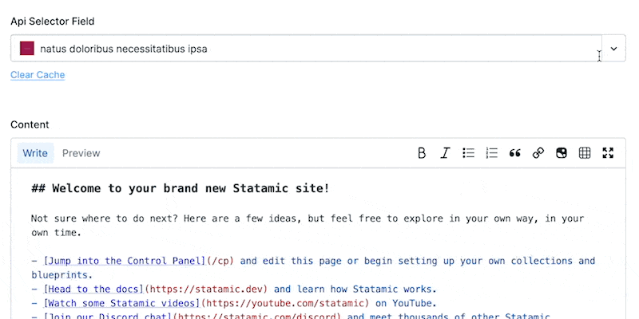

# Statamic Api Selector

> Utilise API endpoints for your Select Fieldtype options.

## How to Install

```bash
composer require el-schneider/statamic-api-selector
```

## How to Use



## Thanks to

[laraluke](https://github.com/laraluke) for his [statamic-api-select](https://github.com/laraluke/statamic-api-select)
